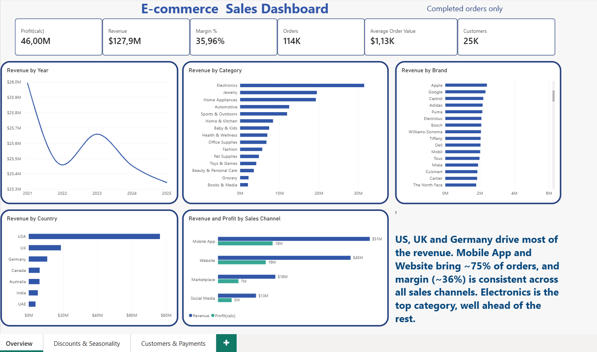
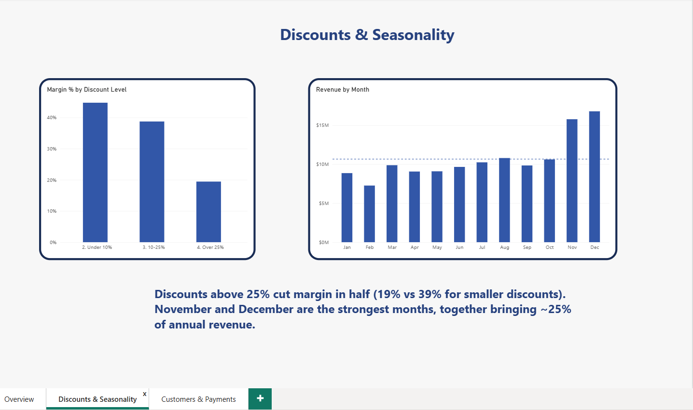
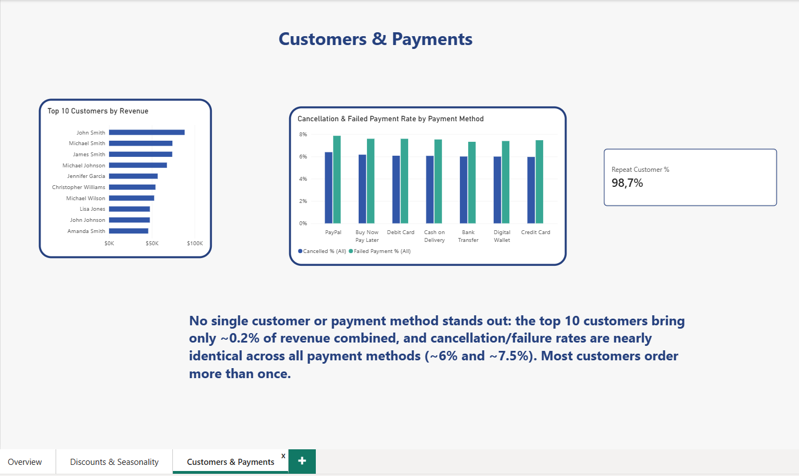

# E-commerce Sales Analysis

SQL + Power BI portfolio project: data cleaning, business analysis, and an interactive dashboard built on an e-commerce sales dataset.

## Dataset

Source: [E-commerce Sales and Customer Analytics](https://www.kaggle.com/datasets/datascikhan/e-commerce-sales-and-customer-analytics) (Kaggle)

Four tables: `Dim_Customers`, `Dim_Products`, `Fact_Sales`, `order_items`. `Fact_Sales` is at order level (138,116 orders), `order_items` is a line-item bridge table.

## Tools

- **Power BI Desktop (Power Query)** — first data cleaning, data model, DAX measures, interactive dashboard
- **DataGrip** (PostgreSQL) — second data cleaning, quality checks, business SQL queries

## Data Preparation

The pipeline had two cleaning stages:

1. **Power Query (Power BI):** the original Kaggle dataset contained 6 tables; I kept the 4 needed for analysis (`Dim_Customers`, `Dim_Products`, `Fact_Sales`, `order_items`). I removed unused columns (e.g. `Fact_Sales` was reduced from 46 columns to 31), converted text columns to numeric and date types, and exported the cleaned tables to Excel/CSV.
2. **PostgreSQL (DataGrip):** after loading the files, PostgreSQL again did not recognise decimal commas and date formats, so I cleaned the data a second time in SQL (`00_data_cleaning.sql`).

## Project Structure

ecommerce-sales-analysis/
├── README.md
├── sql/
│   ├── 00_data_cleaning.sql - type conversion, date/decimal fixes
│   ├── 01_data_quality_checks.sql - validation checks + reconciled view
│   └── 02_business_analysis.sql - 12 business questions (Q1-Q12)
├── powerbi/
│   ├── ecommerce_dashboard.pbix
│   └── power_query_steps.txt
└── screenshots/
    ├── page1_overview.png
    ├── page2_discounts_seasonality.png
    └── page3_customers_payments.png

## Data Quality & Assumptions

- **Verified formulas** (checked on all 138,116 orders, 0 violations): `net_sales = gross_sales - discount_amount + tax_amount + shipping_cost`; `profit = net_sales - product_cost - shipping_cost`.
- **Custom metrics:** the source `profit` includes tax as income. To avoid overstating results, this project defines Revenue = `gross_sales - discount_amount` and Profit = Revenue - `product_cost`.
- **Currency:** the `currency` column has 7 values, but average order value is nearly identical across all of them (~1,371-1,395), so it is treated as a label only — no conversion applied.
- **Data inconsistency:** 11,226 of 138,116 orders (8.1%) have mismatched quantities between `Fact_Sales` and `order_items`. Financial metrics use `Fact_Sales` for all orders; product-level analysis uses a reconciled view, `order_items_clean` (126,890 orders where quantities and totals match).
- **Returns:** the dataset includes `return_status`/`return_reason` fields, but they are empty (NULL) for 100% of orders. Return analysis was not possible from these fields. A separate `order_status` field does include a "Returned" state (9,462 orders, 6.8% of all orders).

## Key Business Findings

1. Yearly revenue is flat (~25.5M/year, within ±2.1%) — no long-term growth, but strong month-to-month volatility.
2. Mobile App and Website bring ~75% of revenue; margin (~36%) is consistent across all sales channels.
3. Electronics leads all categories (31.5M before discounts), more than 1.6x the second category.
4. The top product in each category brings only ~2-3% of its category's revenue — no single "hero product."
5. The top 10 customers bring only ~0.2% of total revenue combined — no dependence on big customers.
6. The US brings ~60% of revenue, UK ~15%, Germany ~8%; average order value is similar across countries.
7. Margin drops sharply with bigger discounts: 45% (under 10%), 39% (10-25%), 19% (over 25%).
8. Organic Search is the largest marketing channel (20% of revenue); margin is ~36% everywhere. Marketing cost data was not available, so ROI could not be calculated.
9. Cancellation (~6%) and failed payment (~7.5%) rates are nearly identical across all payment methods.
10. 98.7% of customers placed more than one order — a very high repeat rate, likely reflecting the synthetic nature of the dataset.
11. The five biggest revenue-growth months are every November (2021-2025), up 40-56% vs. October.
12. November (index 148) and December (158) are far above an average month (100) and bring ~25% of annual revenue together; February is the weakest month (68).

**Recommendation:** review discounts above 25% (they cut margin in half), and plan stock and marketing around the November-December peak.

## Dashboard

Three pages:
1. **Overview** — KPIs, yearly revenue trend, revenue by category/brand/country, revenue and margin by sales channel
2. **Discounts & Seasonality** — margin by discount level, monthly seasonality
3. **Customers & Payments** — top 10 customers, cancellation/failed payment rate by payment method, repeat customer rate

## How to Reproduce

1. Download the dataset from Kaggle, keep the 4 tables listed above, clean them in Power Query (remove unused columns, set numeric/date types), export to CSV, and load them into PostgreSQL.
2. Run `sql/00_data_cleaning.sql` once (converts text columns to proper types).
3. Run `sql/01_data_quality_checks.sql` (validates data, creates the `order_items_clean` view).
4. Run `sql/02_business_analysis.sql` for the business queries.
5. Open `powerbi/ecommerce_dashboard.pbix` in Power BI Desktop and connect it to your database.

---

# Analiza sprzedaży e-commerce

Projekt portfolio SQL + Power BI: czyszczenie danych, analiza biznesowa i interaktywny dashboard oparty na zbiorze danych sprzedaży e-commerce.

## Zbiór danych

Źródło: [E-commerce Sales and Customer Analytics](https://www.kaggle.com/datasets/datascikhan/e-commerce-sales-and-customer-analytics) (Kaggle)

Cztery tabele: `Dim_Customers`, `Dim_Products`, `Fact_Sales`, `order_items`. `Fact_Sales` jest na poziomie zamówienia (138 116 zamówień), `order_items` to tabela pomostowa z pozycjami zamówień.

## Narzędzia

- **Power BI Desktop (Power Query)** — czyszczenie danych (1 etap), model danych, miary DAX, interaktywny dashboard
- **DataGrip** (PostgreSQL) — czyszczenie danych (2 etap), kontrola jakości, zapytania SQL

## Przygotowanie danych

Proces czyszczenia składał się z dwóch etapów:

1. **Power Query (Power BI):** oryginalny zbiór z Kaggle zawierał 6 tabel; zostawiłam 4 potrzebne do analizy (`Dim_Customers`, `Dim_Products`, `Fact_Sales`, `order_items`). Usunęłam zbędne kolumny (np. `Fact_Sales` zmniejszyłam z 46 do 31 kolumn), zamieniłam kolumny tekstowe na typy liczbowe i daty, a oczyszczone tabele wyeksportowałam do Excela/CSV.
2. **PostgreSQL (DataGrip):** po załadowaniu plików PostgreSQL ponownie nie rozpoznał przecinków dziesiętnych i formatów dat, więc dane wyczyściłam drugi raz w SQL (`00_data_cleaning.sql`).

## Struktura projektu

Patrz sekcja "Project Structure" powyżej — struktura plików jest taka sama dla obu wersji językowych.

## Jakość danych i przyjęte założenia

- **Zweryfikowane wzory** (sprawdzone na wszystkich 138 116 zamówieniach, brak odchyleń): `net_sales = gross_sales - discount_amount + tax_amount + shipping_cost`; `profit = net_sales - product_cost - shipping_cost`.
- **Własne metryki:** źródłowy `profit` zawiera podatek jako przychód. Aby nie zawyżać wyników, w projekcie przyjęto: Przychód = `gross_sales - discount_amount`, Zysk = Przychód - `product_cost`.
- **Waluta:** kolumna `currency` zawiera 7 wartości, ale średnia wartość zamówienia jest niemal identyczna we wszystkich z nich (ok. 1 371-1 395), więc traktowana jest wyłącznie jako etykieta — bez przeliczania.
- **Niespójność danych:** w 11 226 z 138 116 zamówień (8,1%) ilości w `Fact_Sales` i `order_items` się różnią. Metryki finansowe liczone są z `Fact_Sales` dla wszystkich zamówień; analiza produktów korzysta z uzgodnionego widoku `order_items_clean` (126 890 zamówień, w których ilości i sumy się zgadzają).
- **Zwroty:** zbiór danych zawiera pola `return_status`/`return_reason`, ale są one puste (NULL) dla 100% zamówień. Analiza zwrotów na ich podstawie nie była możliwa. Osobne pole `order_status` zawiera jednak status "Returned" (9 462 zamówienia, 6,8% wszystkich zamówień).

## Kluczowe wnioski biznesowe

1. Roczna wyprzedaż jest stabilna (~25,5 mln rocznie, w granicach ±2,1%) — brak długoterminowego wzrostu, ale duża zmienność miesiąc do miesiąca.
2. Mobile App i Website dają ~75% przychodu; marża (~36%) jest spójna we wszystkich kanałach sprzedaży.
3. Electronics prowadzi wśród wszystkich kategorii (31,5 mln przed rabatami), ponad 1,6 razy więcej niż druga kategoria.
4. Najlepszy produkt w każdej kategorii daje tylko ~2-3% przychodu swojej kategorii — brak jednego "hitu sprzedażowego".
5. Top 10 klientów daje łącznie tylko ~0,2% całkowitego przychodu — brak zależności od dużych klientów.
6. USA daje ~60% przychodu, Wielka Brytania ~15%, Niemcy ~8%; średnia wartość zamówienia jest podobna we wszystkich krajach.
7. Marża gwałtownie spada wraz ze wzrostem rabatu: 45% (poniżej 10%), 39% (10-25%), 19% (powyżej 25%).
8. Organic Search to największy kanał marketingowy (20% przychodu); marża wynosi ~36% wszędzie. Dane o kosztach marketingu nie były dostępne, więc nie dało się policzyć ROI.
9. Wskaźniki anulowania (~6%) i nieudanych płatności (~7,5%) są niemal identyczne dla wszystkich metod płatności.
10. 98,7% klientów złożyło więcej niż jedno zamówienie — bardzo wysoki wskaźnik powtarzalności, prawdopodobnie wynikający z syntetycznego charakteru zbioru danych.
11. Pięć największych miesięcy wzrostu przychodu to każdorazowo listopad (2021-2025), wzrost o 40-56% względem października.
12. Listopad (indeks 148) i grudzień (158) są znacznie powyżej przeciętnego miesiąca (100) i razem dają ~25% rocznego przychodu; luty jest najsłabszym miesiącem (68).

**Rekomendacja:** przeanalizować rabaty powyżej 25% (obniżają marżę o połowę) oraz zaplanować zapasy i marketing wokół szczytu listopad-grudzień.

## Dashboard

Trzy strony:
1. **Overview** — KPI, roczny trend przychodu, przychód wg kategorii/marki/kraju, przychód i marża wg kanału sprzedaży
2. **Discounts & Seasonality** — marża wg poziomu rabatu, sezonowość miesięczna
3. **Customers & Payments** — top 10 klientów, wskaźnik anulowania/nieudanych płatności wg metody płatności, wskaźnik powracających klientów

Zrzuty ekranu — patrz sekcja "Dashboard" powyżej.

## Jak odtworzyć projekt

Patrz sekcja "How to Reproduce" powyżej — kroki są identyczne dla obu wersji.
